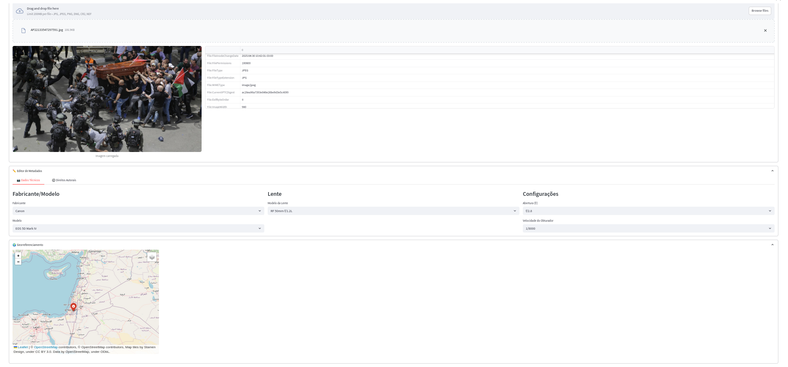

# 📸 EXIF-Editor com Mapa Interativo

Uma aplicação web feita com **Streamlit** que permite **editar metadados EXIF de imagens** (como localização GPS e dispositivo utilizado) de forma visual e intuitiva, usando um **mapa interativo com marcador arrastável**.

## ✨ Funcionalidades

- 📂 Upload de imagens JPG/JPEG
- 🔍 Visualização dos metadados EXIF originais
- 🗺️ Mapa interativo com marcador para selecionar nova localização
- 🖱️ Atualização automática dos metadados ao mover o marcador
- 💾 Download da imagem com metadados atualizados
- 💡 Interface moderna com layout responsivo e estilizado

## 🖼️ Exemplo

 <!-- Opcional: capture uma imagem da interface e salve em `docs/screenshot.png` -->

## 🚀 Como usar

### 1. Clone o repositório

```bash
git clone https://github.com/seu-usuario/exif-mapa-editor.git
cd exif-mapa-editor
```

### 2. Instale as dependências

É recomendado usar um ambiente virtual:

```bash
python -m venv venv
source venv/bin/activate  # no Windows use: venv\Scripts\activate
pip install -r requirements.txt
```

### 3. Instale o [ExifTool](https://exiftool.org/)

Você precisa do `exiftool` instalado no sistema. No Linux:

```bash
sudo apt install libimage-exiftool-perl
```

No macOS (com Homebrew):

```bash
brew install exiftool
```

No Windows: [baixe aqui](https://exiftool.org/)

### 4. Rode a aplicação

```bash
streamlit run app.py
```

## 📁 Estrutura do Projeto

```
.
├── app.py                  # Arquivo principal da aplicação
├── utils/
│   └── exif.py             # Funções para leitura e escrita dos metadados
├── requirements.txt        # Dependências do projeto
├── docs/
│   └── screenshot.png      # Captura da interface (opcional)
└── README.md               # Este arquivo
```

## 🧠 Tecnologias Utilizadas

- [Streamlit](https://streamlit.io/) – Interface web
- [Folium](https://python-visualization.github.io/folium/) – Mapa interativo
- [Pillow](https://pillow.readthedocs.io/) – Manipulação de imagem
- [ExifTool](https://exiftool.org/) – Leitura e escrita de metadados


## 📜 Licença

Distribuído sob a licença MIT. Veja `LICENSE` para mais informações.

---

Desenvolvido com Café ☕ 
